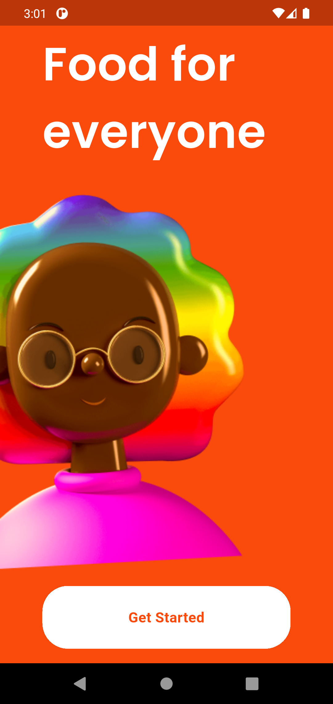
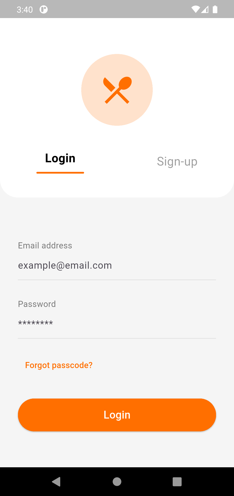
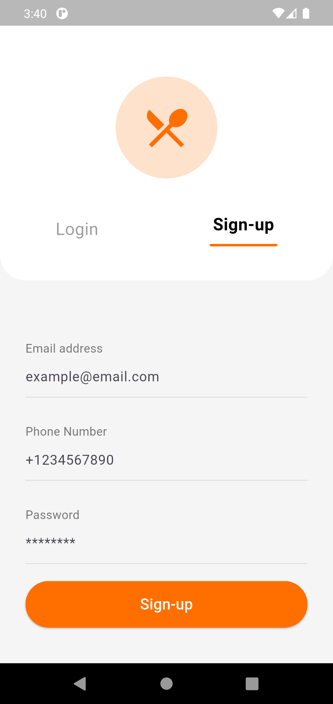

# 🍔 Khanna Food Delivery App UI

Welcome to the **Khanna Food Delivery App UI** project! This repository showcases a modern, intuitive, and visually appealing user interface designed to elevate the food ordering experience. Built with Flutter, this UI prioritizes seamless navigation and efficient interaction from browsing to checkout.

## Project Overview

Our goal with Khanna was to craft a food delivery application that stands out not just in functionality, but in its dedication to an exceptional user experience. We believe a great UI makes ordering your favorite meals a delight!

### Key Highlights & Features:

* **Intuitive Navigation**: Designed for effortless browsing and quick access to features, helping users find exactly what they need, fast.
* **Visually Appealing Layouts**: Meticulously designed screens with a clean, modern aesthetic that makes exploring menus and restaurants a pleasure. Feast your eyes before you feast on your food!
* **Super-Efficient Order Flow**: A streamlined and frictionless journey from selecting items, to customizing orders, to a swift checkout process.
* **Seamless Responsive Design**: Optimized to look and perform beautifully across various mobile devices and screen sizes, ensuring a consistent experience for every user.

## Technology Stack

This project is built entirely with:

* **Flutter**: Google's UI toolkit for building natively compiled applications for mobile, web, and desktop from a single codebase.

## See the UI in Action!
Here's a glimpse of the Canvas app in action:

