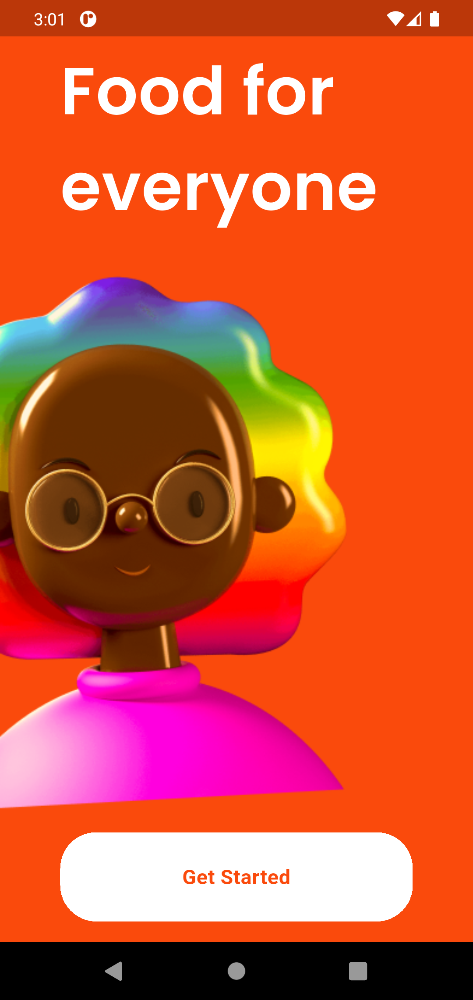
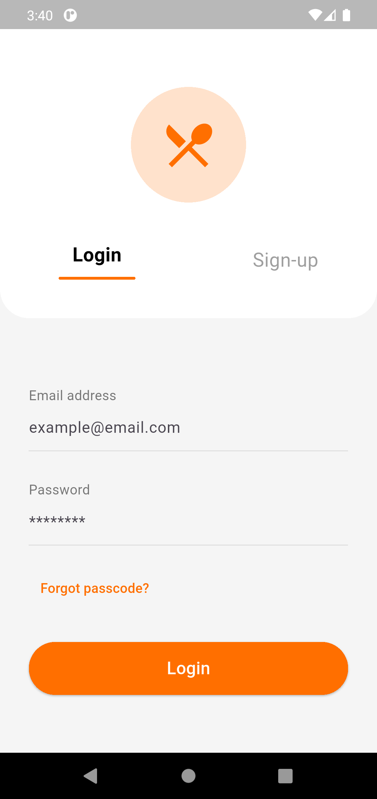
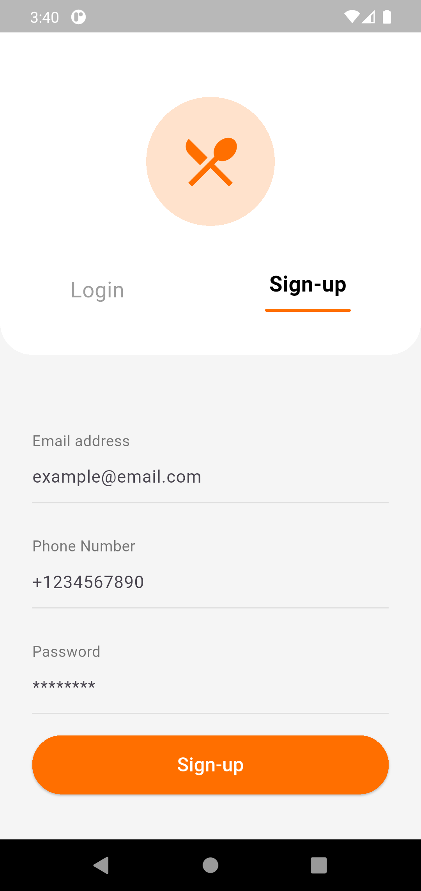
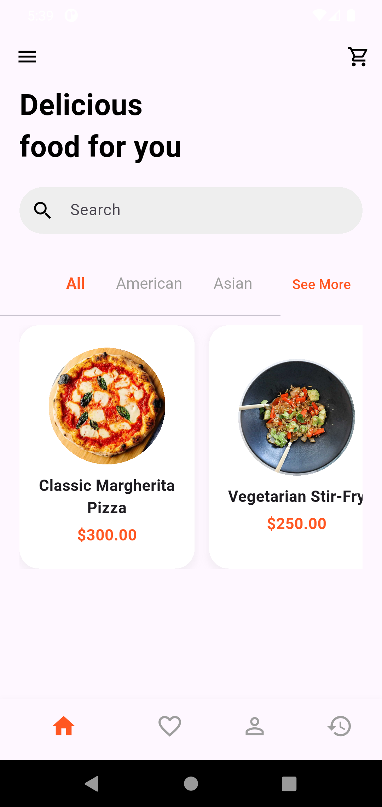
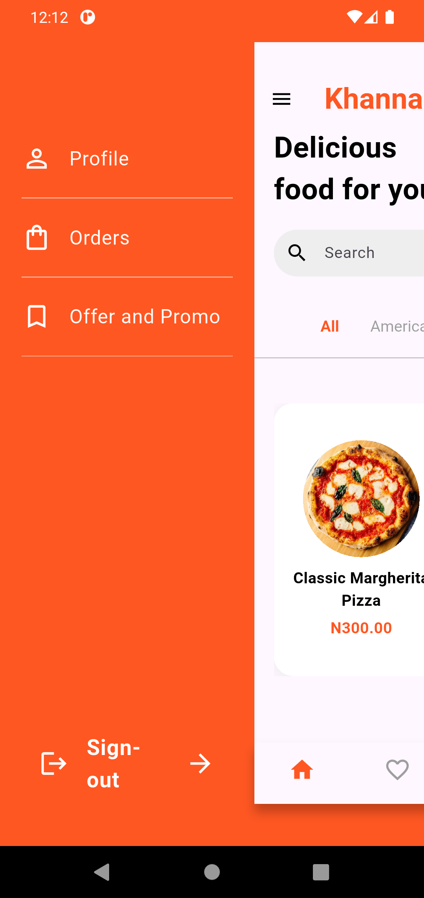
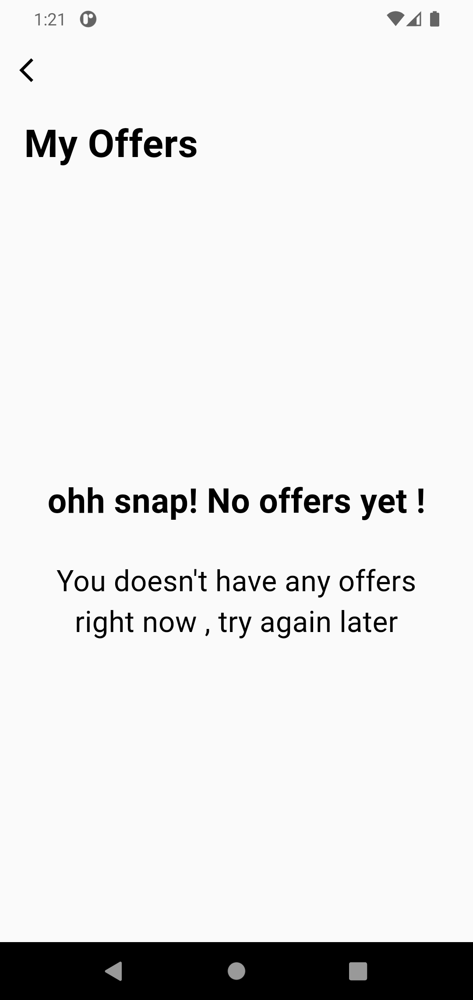
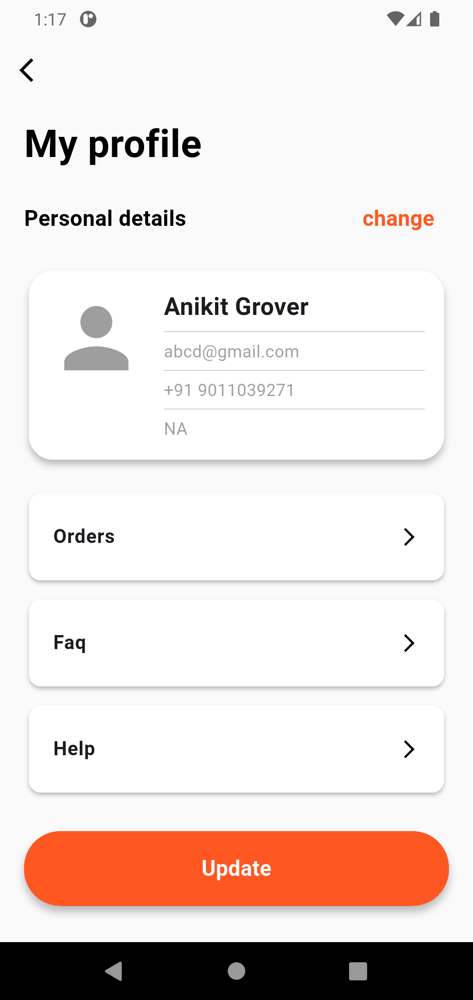
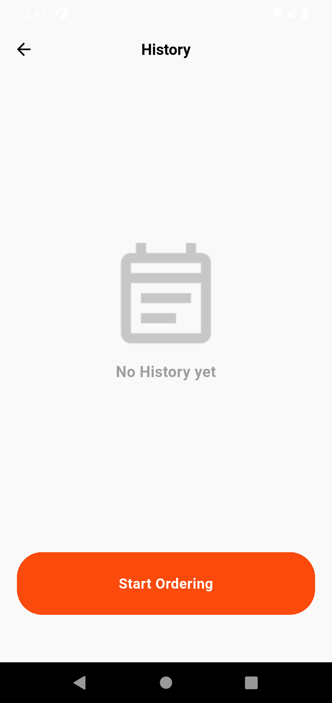
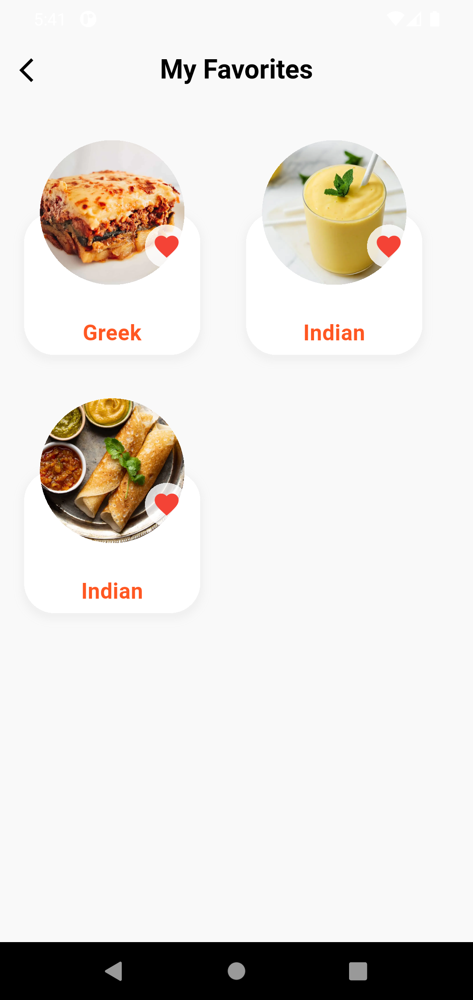
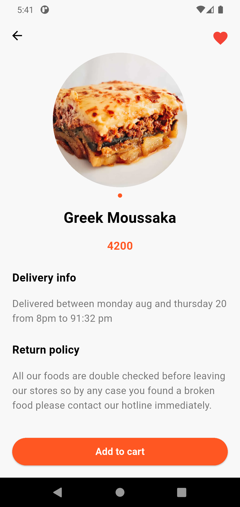

# 🍔 Khanna Food Delivery App UI

Welcome to the **Khanna Food Delivery App UI** project\! This repository showcases a modern, intuitive, and visually appealing user interface designed to elevate the food ordering experience. Built with Flutter, this UI prioritizes seamless navigation and efficient interaction from Browse to checkout.

-----

## Project Overview

Our goal with Khanna was to craft a food delivery application that stands out not just in functionality, but in its dedication to an exceptional user experience. We believe a great UI makes ordering your favorite meals a delight\!

-----

### Key Highlights & Features:
* **Engaging Onboarding**
 A smooth and welcoming introduction for new users.

* **Intelligent Search**
 Real-time dish discovery with clear "Item Not Found" feedback.

* **Synchronized Favorites**
 Effortlessly manage and view your favorite dishes across all screens (Home, Search, Dedicated Favorites).

* **Streamlined Cart & Checkout**
 A smooth flow from item selection to order completion.

* **Comprehensive Order History & Profiles**
 Easy access to past orders and personal account management.

* **Intuitive Navigation**
 Enhanced Home Screen with left-aligned tabs and an integrated navigation drawer for quick access to Profile, Orders, and Offers.

* **Sleek & Modern Aesthetic**
 A clean UI facelift with a premium feel, featuring transparent pricing and optimized readability.

* **High Performance & Responsiveness**
 Engineered for speed, smooth animations, and a consistent experience across diverse mobile devices

-----

## Technology Stack

This project is built entirely with:

  * **Flutter**: Google's UI toolkit for building natively compiled applications for mobile, web, and desktop from a single codebase.

* **Bloc**: Robust state management for predictable and scalable application logic (Favorites, Search, Cart).

* **Advanced Drawer**: Customizable navigation drawer.

* **Shimmer**: Elegant loading animations for enhanced user perception.

* **SVG**: Scalable vector graphics for crisp visuals.

* **HTTP**: For efficient network data fetching.
-----

## See the UI in Action

Here's a glimpse of the Khanna app in action:

