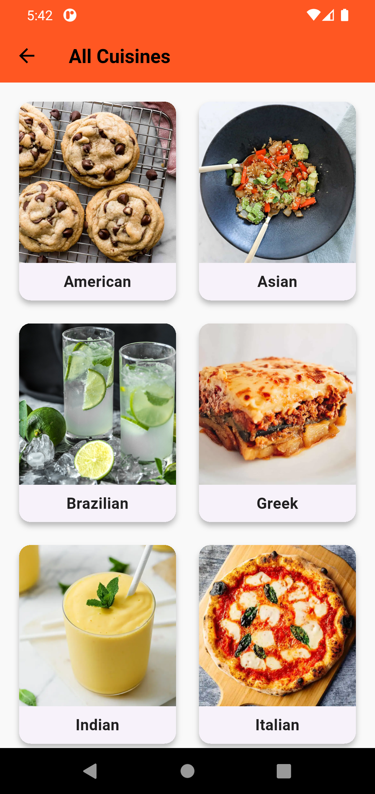
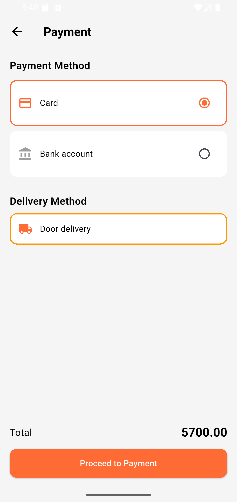
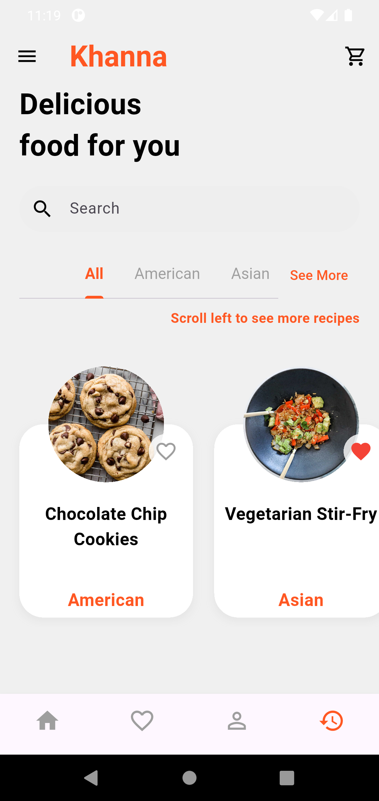
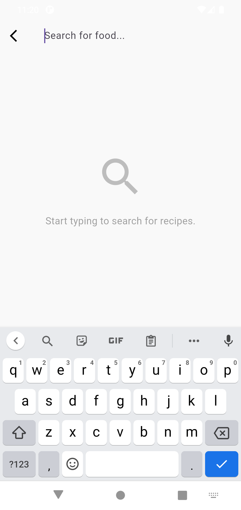
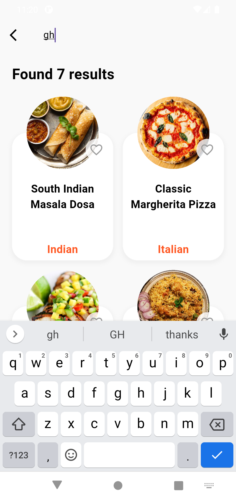
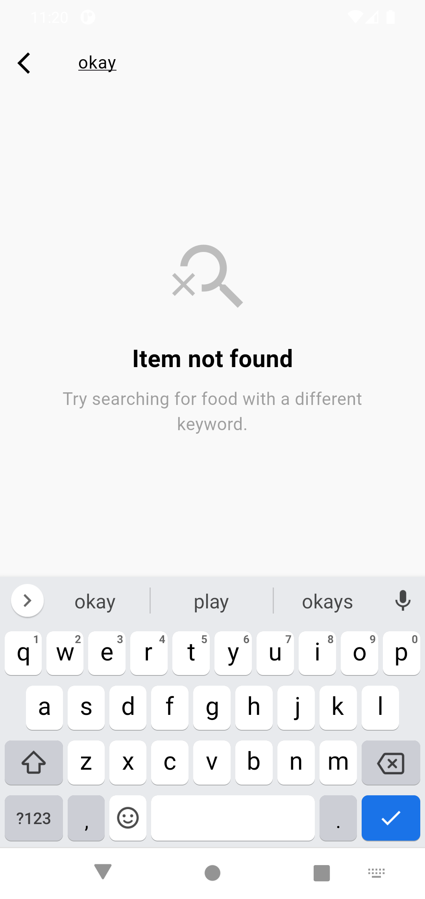

# 🍔 Khanna Food Delivery App UI

Welcome to the **Khanna Food Delivery App UI** project! This repository showcases a modern, intuitive, and visually appealing user interface designed to elevate the food ordering experience. Built with **Flutter**, this UI emphasizes seamless navigation, real-time interactivity, and consistent design — from browsing dishes to managing your favorites and checking out.

---

## 🚀 Project Overview

Khanna is more than just another food delivery UI — it’s a full-fledged, **mobile-first experience** crafted with pixel precision. With thoughtful animations, consistent component reuse, and smooth state management, Khanna ensures your users enjoy a fast, cohesive, and polished experience across screens.

---

## 🌟 Key Highlights & Features

- 🔥 **Engaging Onboarding**  
  A clean and welcoming intro flow to guide first-time users.

- 🔍 **Smart Real-time Search**  
  Instant dish filtering with live feedback and graceful handling of “Item not found.”

- ❤️ **Unified Favorites System**  
  Add/remove favorites anywhere (Home, Search) and view them consistently in the **Favorites** screen with the **same FoodCard UI**.

- 🛒 **Clean Cart & Checkout Flow**  
  Smooth item selection and seamless order placement experience.

- 🧾 **Order History & Profile Management**  
  Access past orders, manage account info, and keep your app experience personal.

- 📱 **Reusable `FoodCard` UI**  
  Consistent design reused across Home, Search, and Favorites — now layout-aware for grid and list contexts.

- 🧭 **Intuitive Navigation**  
  Includes a modern navigation drawer with quick access to **Profile**, **Orders**, and **Offers**.

- ✨ **Modern Aesthetic**  
  Clean fonts, bright visuals, consistent paddings, and adaptive card designs make the UI visually delightful.

- ⚡ **Smooth & Responsive UX**  
  Optimized for speed with support for all device sizes, ensuring smooth animations and transitions.

---

## 🧰 Tech Stack

This project is built using:

- **Flutter** – Cross-platform UI toolkit.
- **Bloc** – For clean, testable, and scalable state management.
- **Advanced Drawer** – For customizable drawer navigation.
- **Shimmer** – Adds beautiful loading states.
- **SVG** – Sharp vector images for scalable design.
- **HTTP** – Efficient network layer for API integration.

---

## See the UI in Action

Here's a glimpse of the Khanna app in action:

